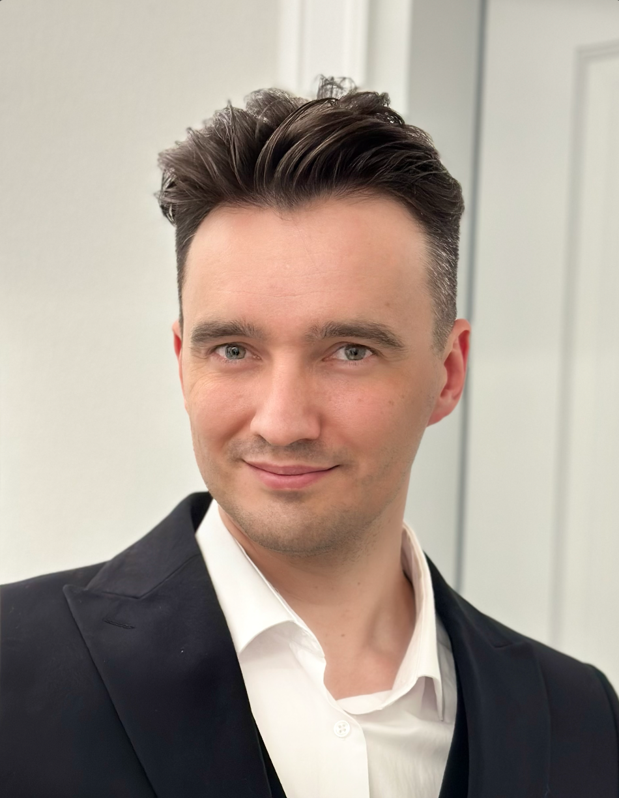

  
  
  # Denis Matakov
  
  ### CTO & Head of Development
  #### Software Architect | Tech Leader
  
  

## About Me 👨‍💻

Technology leader with extensive experience in building and scaling engineering teams. Architect of distributed systems and mentor for next-gen developers. Specializing in high-load fintech solutions and enterprise architecture.

- 🎯 CTO focused on scaling engineering excellence
- 💡 Head of Development driving technical innovation
- 🏗️ Software Architect designing robust distributed systems
- 👥 Leading and mentoring development teams
- 🌍 Based in Europe

## Tech Stack 🛠️

| Category | Technologies |
|----------|-------------|
| Languages |   |
| Backend |   |
| Databases |   |
| DevOps |   |
| Tools |   |

## Leadership & Expertise 🎯

- **Technical Leadership**: Building and scaling engineering teams
- **Architecture Design**: Microservices, Cloud-native solutions
- **Team Development**: Mentoring, Technical roadmaps
- **Technology Strategy**: Digital transformation, Tech stack optimization

## Connect With Me 🤝

- 📫 Email: denis@matakov.com
- 💼 LinkedIn: [Denis Matakov](https://linkedin.com/in/matakov)
- 🌐 Website: [matakov.com](https://matakov.com)
- 📱 Telegram: [@matakov](https://t.me/matakov)

## GitHub Stats 📊

  

---

  Let's build something amazing together! 🚀

